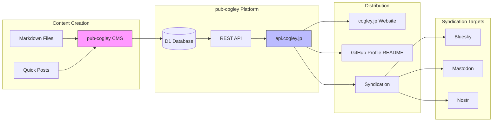
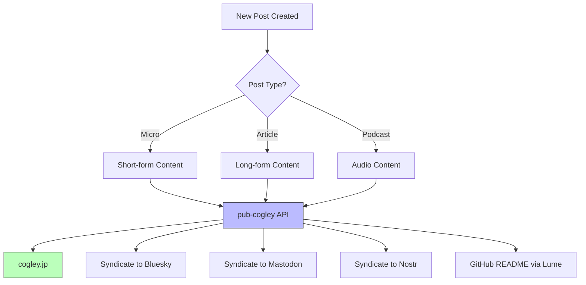

  

**Last Updated:**&nbsp; March 23rd, 2026 at 4:52:49 PM GMT+9
**Today is:**&nbsp; Thursday, April 30, 2026

### Hi there 👋

Bilingual IT consultant in Japan since 1987. Based in Yokohama, working in Tokyo.

### Career

I came to Japan in 1987 as a research student at the University of Tokyo. Programming turned out to be far more interesting than animal experiments, so I pivoted to tech.

My first job (around 1989) was at a telephone card ("teleca") design company, where I built and ran the office network. This was right when "DOS/V" machines were taking off in Japan after IBM released the PS/2 with its kanji processing chip. A PS/2 cost around ¥2M; a DOS/V clone was maybe ¥250K. That's where my technical career started.

From there I moved to a network support company doing helpdesk, user support, and network engineering. In 1993 I co-founded a PC training company, serving as CIO and building the technology operations side from scratch.

In the summer of 1999 I founded [eSolia Inc.](https://esolia.co.jp), my current firm. We've been providing bilingual IT outsourcing and infrastructure services to international companies in Tokyo for over 26 years, and are working on ISO 27001 implementation.

### Current Tech Stack

Building web applications in TypeScript with [SvelteKit](https://svelte.dev) + [Cloudflare Workers](https://developers.cloudflare.com/workers/). Full-stack on D1 (SQLite), R2, and KV.

**Projects:**
- [cogley.jp](https://cogley.jp) — Articles on tech, business, and Japan (SvelteKit + Cloudflare Workers)
- [svelte.cogley.jp](https://svelte.cogley.jp) — Interactive migration reference: React/Vue/Angular to Svelte 5 (bilingual EN/JA)
- [rick.cogley.jp](https://rick.cogley.jp) — Profile site
- [pulse.esolia.co.jp](https://pulse.esolia.co.jp) — Security & compliance management. Tracks compliance against ISO 27001, CIS Controls, and other frameworks (SvelteKit + Cloudflare Workers)
- [periodic.esolia.co.jp](https://periodic.esolia.co.jp) — DNS & email security monitoring. Drift detection for DMARC/SPF/DKIM and domain security (SvelteKit + Cloudflare Workers)
- [courier.esolia.co.jp](https://courier.esolia.co.jp) — Secure file sharing with PIN protection and auto-expiry for sensitive communications (SvelteKit + Cloudflare Workers)

> _"As I grow older, I pay less attention to what people say. I just watch what they do."_ — Andrew Carnegie

### 😤 Currently: Swamped

**Working on:** Centralized types in core package, scripts and rules in .github repo

_Packed schedule, minimal interruptions_

### GitHub Activity (last 30 days)

**986** commits &nbsp;|&nbsp; **727** this week &nbsp;|&nbsp; 🔥 **29**-day streak

**Languages:** TypeScript (18) · Svelte (2) · CSS (1) · PowerShell (1) · Python (1)
**Active repos (18):** `eSolia/codex` `RickCogley/pub-cogley` `eSolia/esolia-2025` `eSolia/nexus` `eSolia/periodic` and 13 more
### What I'm Up To This Week

**Themes:** `personal` `japan`

**Activity:** 1 posts, 2 articles this week

### Currently Reading

📖 **User Friendly: How the Hidden Rules of Design Are Changing the Way We Live, Work, and Play** by Cliff Kuang, Robert Fabricant

### Latest Posts

- 💬 [Just a STUNNING London Marathon result, with two sub-2-hour finishes....](https://cogley.jp) personal
- 📝 [The Soul of Japanese Shoes: Kurume, Asakusa, and a Dutch Word](https://cogley.jp/japanese-shoes) japan
- 📝 [日本の靴のたましい：久留米の釜、浅草の錐、そしてオランダ語の物語](https://cogley.jp/japanese-shoes) japan
- 📝 [Cloudflare Workers HTML to Markdown: Free-Plan Edition](https://cogley.jp/cloudflare-workers-html-to-markdown) tech
- 📝 [Cloudflare Workers無料プランでHTML→Markdown変換](https://cogley.jp/cloudflare-workers-html-to-markdown) tech

### Content Stats

| Type | Count |
| --- | --- |
| Posts | 2261 |
| Articles | 84 |
| Podcasts | 9 |
| Pages | 10 |

### System Architecture

### Content Flow

### Build Stats

| Item | Value |
| --- | --- |
| Repo Total Files | 0 |
| Repo Size in KB | 5056 |
| Lume Version | v3.2.4 |
| Deno Version | 2.7.13 (linux x86_64) |
| V8 Version | 14.7.173.20-rusty |
| Typescript Version | 5.9.2 |
| Timezone | Asia/Tokyo |

### How does this readme work?

I'm generating this readme using the [Lume](https://lume.land) static site generator, pulling data from my [pub-cogley](https://github.com/rickcogley/pub-cogley) API. See [this page](https://rickcogley.github.io/rickcogley/) for details to get your own!

### Tech Stack

	<code></code>
	<code></code>
	<code></code>
	<code></code>
	<code></code>
	<code></code>
	<code></code>
	<code></code>
	<code></code>
	<code></code>
	<code></code>
	<code></code>
	<code></code>
	<code></code>
	<code></code>
	<code></code>
	<code></code>
	<code></code>
	<code></code>

