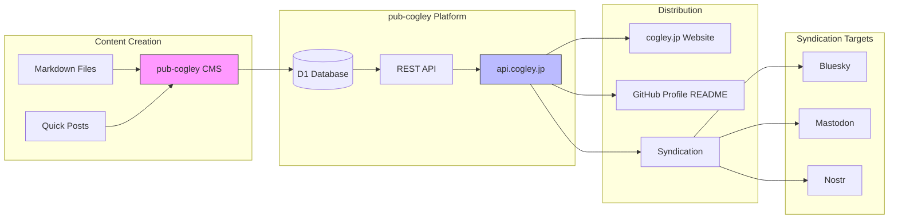
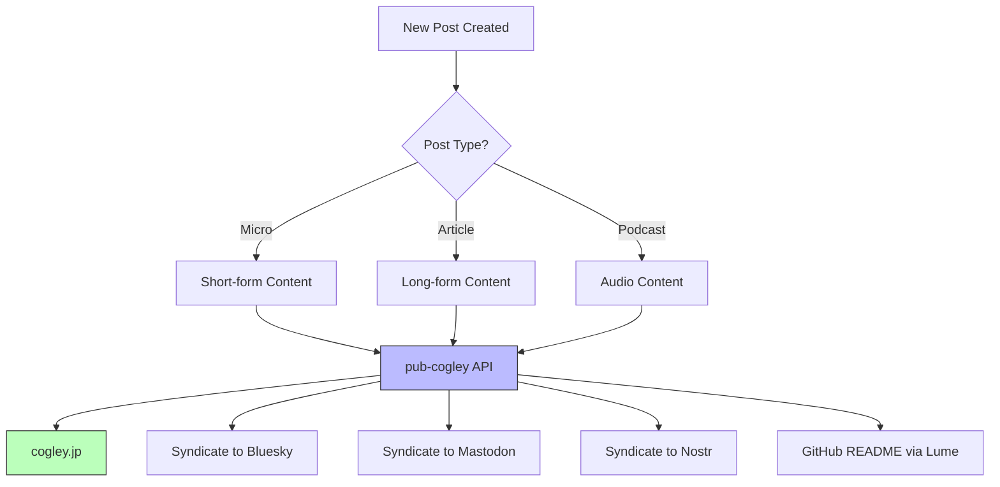

 

**Last Updated:**&nbsp; February 28th, 2026 at 9:23:26 AM GMT+9
**Today is:**&nbsp; Saturday, March 21, 2026

### Hi there 👋

I founded [eSolia](https://esolia.com), a boutique IT services firm based in Tokyo, in 1999. We passed our 25th anniversary in July 2024 and hope to stay healthy and profitable, working on improving our operations by implementing ISO 27001.

I have spent my career in IT in Japan, doing a wide range of activities, such as compsci tutoring, physical cabling, network engineering, project management, software development, system architecture and design, solution consulting, web design and development, and delivering training courses to name a few. Sometimes I look back with nostalgia on the way things were in the late '80s, but mostly, I like how things are now (you're _old_ if you remember the struggle of `autoexec.bat` and `config.sys`, and trying to squeeze drivers into limited memory)!

> _"I must not fear. Fear is the mind-killer. Fear is the little-death that brings total obliteration. I will face my fear. I will permit it to pass over me and through me. And when it has gone past, I will turn the inner eye to see its path. Where the fear has gone there will be nothing. Only I will remain."_ — Frank Herbert, Dune, 'Litany Against Fear'

### 😤 Currently: Swamped

**Working on:** Centralized types in core package, scripts and rules in .github repo

_Packed schedule, minimal interruptions_

### GitHub Activity (last 30 days)

**830** commits &nbsp;|&nbsp; **220** this week &nbsp;|&nbsp; 🔥 **29**-day streak

**Languages:** TypeScript (14) · HTML (2) · CSS (2) · Svelte (1) · Vento (1)
**Active repos (15):** `eSolia/esolia-2025` `eSolia/codex` `RickCogley/pub-cogley` `eSolia/periodic` `eSolia/courier` and 10 more
### What I'm Up To This Week

**Themes:** `japan` `tech` `business`

**Activity:** 2 posts, 2 articles this week

### Currently Reading

📖 **User Friendly: How the Hidden Rules of Design Are Changing the Way We Live, Work, and Play** by Cliff Kuang, Robert Fabricant

### Latest Posts

- 💬 [Learners of Japanese: I revamped my 'goroawase' Japanese word play page to make ...](https://cogley.jp) japan
- 📝 [Cloudflare Pages vs Workers in 2026: Migration Guide](https://cogley.jp/cloudflare-pages-to-workers-migration) tech
- 💬 [I wrote a long-form article about data sovereignty on my company site, after see...](https://cogley.jp) business
- 📝 [Migrating 8 SvelteKit Sites to Vite 8 in a day: What We Learned](https://cogley.jp/migrating-sveltekit-to-vite-8) tech
- 💬 [Updated 10 SvelteKit apps to use vite 8. Very quick to build, uses rolldown and ...](https://cogley.jp) tech

### Content Stats

| Type | Count |
| --- | --- |
| Posts | 2253 |
| Articles | 63 |
| Podcasts | 9 |
| Pages | 10 |

### System Architecture

### Content Flow

### Build Stats

| Item | Value |
| --- | --- |
| Repo Total Files | 7 |
| Repo Size in KB | 5023 |
| Lume Version | v2.5.0 |
| Deno Version | 2.7.7 (linux x86_64) |
| V8 Version | 14.6.202.9-rusty |
| Typescript Version | 5.9.2 |
| Timezone | Asia/Tokyo |

### How does this readme work?

I'm generating this readme using the [Lume](https://lume.land) static site generator, pulling data from my [pub-cogley](https://github.com/rickcogley/pub-cogley) API. See [this page](https://rickcogley.github.io/rickcogley/) for details to get your own!

### Tech Stack

	<code></code>
	<code></code>
	<code></code>
	<code></code>
	<code></code>
	<code></code>
	<code></code>
	<code></code>
	<code></code>
	<code></code>
	<code></code>
	<code></code>
	<code></code>
	<code></code>
	<code></code>
	<code></code>
	<code></code>
	<code></code>
	<code></code>

