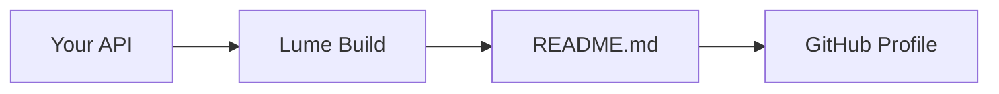

## Github's Special Profile Repos

Github has a special feature where, the `README.md` from a repository with the
same name as your Github username is displayed on your Github profile. My Github
handle and profile is [@rickcogley](https://github.com/rickcogley), and you're
looking at a page served via Github Pages from that very repository. In my case,
it's [rickcogley / rickcogley](https://github.com/rickcogley/rickcogley).


## The Concept

I use the static site generator
«[Lume ルメ](https://lume.land/)» and its companion
[Vento](https://vento.js.org/) templates, both coded by
[Óscar Otero](https://oscarotero.com/), to generate my profile README from live
data. A Vento template produces a markdown file, which Lume copies to the repo
root as `README.md`. Github Actions rebuilds it daily.

The data comes from JSON APIs — in my case, a personal API I built called
[pub-cogley](https://github.com/rickcogley/pub-cogley). But **you can use any
public JSON endpoint**: your blog's API, a CMS, a weather service, a quote API,
whatever you want. The pattern is the same.

## How It Works

There are three pieces:

1. **`src/_data.ts`** — fetches data from APIs and exports it for templates
2. **`src/repo-readme.vto`** — a Vento template that generates markdown
3. **`.github/workflows/update-profile-readme.yml`** — a GitHub Action that
   rebuilds daily

### 1. Fetching Data

The `_data.ts` file runs at build time and exports variables that your template
can use. Here's the core pattern — a generic JSON fetcher with a fallback so the
build never breaks:

```ts
const API_BASE = "https://your-api.example.com/api";

async function fetchJSON<T>(path: string, fallback: T): Promise<T> {
  try {
    const response = await fetch(`${API_BASE}${path}`, {
      headers: { "Accept": "application/json" },
    });
    if (!response.ok) return fallback;
    return await response.json() as T;
  } catch {
    return fallback;
  }
}
```

Then you export whatever data you need:

```ts
// Your latest posts, stats, status — whatever your API serves
export const posts = await fetchJSON("/posts?limit=5", { posts: [] });
export const stats = await fetchJSON("/stats", { posts: 0, articles: 0 });
export const presence = await fetchJSON("/presence", { status: { label: "" } });
```

You can also compute derived values. For example, I pick a daily random quote:

```ts
const dayOfYear = Math.floor(
  (Date.now() - new Date(new Date().getFullYear(), 0, 0).getTime()) / 86400000,
);
export const randomQuote = quotes.quotes.length > 0
  ? quotes.quotes[dayOfYear % quotes.quotes.length]
  : { text: "", source: "" };
```

Any exported variable from `_data.ts` is available in your Vento templates
automatically — that's how Lume's
[shared data](https://lume.land/docs/creating-pages/shared-data/) works.

### 2. The Template

The `repo-readme.vto` template writes markdown using those variables. The
frontmatter sets `url: /repo-readme.md` which tells Lume to output a markdown
file instead of HTML:

```
---
url: /repo-readme.md
---
### Hi there 👋

{{ if randomQuote.text }}
> _"{{ randomQuote.text }}"_ — {{ randomQuote.source }}
{{ /if }}
```

For loops and conditionals work naturally:

```
### Latest Posts

{{ for item of posts.posts }}
- [{{ item.title }}]({{ item.url }})
{{ /for }}
```

One thing to watch: Vento's auto_trim plugin strips whitespace around block tags
(`if`, `for`, `set`). If your markdown list items or sections collapse together,
pre-build the content into an array with `{{ set }}`, then loop over plain
strings:

```
{{ set items = [] }}
{{ for item of posts.posts }}
{{ set items = items.concat("- " + item.title) }}
{{ /for }}
{{ for line of items }}
{{ line }}
{{ /for }}
```

You can also include [mermaid](https://mermaid.js.org/) diagrams — Github
renders them natively in markdown:

````

````

### 3. Build & Copy

In `_config.ts`, a post-build script copies the generated readme to the repo
root:

```ts
site.script("copyreadme", "cd _site && cp repo-readme.md ../README.md");
site.addEventListener("afterBuild", "copyreadme");
```

If you have data that needs fetching via a shell command (e.g. a curl to a
protected API), you can add a pre-build script too:

```ts
site.script("getdata", "curl https://api.example.com/data -o src/_data/data.json");
site.addEventListener("beforeBuild", "getdata");
```

## Automate with GitHub Actions

The GitHub Actions workflow rebuilds the site on push, manual trigger, or a cron
schedule:

```yaml
on:
  push:
    branches: [main]
  workflow_dispatch:
  schedule:
    - cron: "30 16 * * *"  # daily at 16:30 UTC
```

The workflow installs Deno, runs `deno task build`, then auto-commits any
changes. The key steps:

```yaml
- uses: denoland/setup-deno@v2
  with:
    deno-version: v2.x

- run: deno task build

- uses: stefanzweifel/git-auto-commit-action@v5
  with:
    commit_message: Apply changes during gh actions build
```

If your API requires authentication, store the token as a repository secret and
pass it as an environment variable:

```yaml
- run: deno task build
  env:
    API_KEY: ${{ secrets.MY_API_KEY }}
```

## Get Your Own

1. Go to my [profile repo](https://github.com/rickcogley/rickcogley) and click
   **"Use this template"** to make your own copy. Name the repo as your GitHub
   username.
2. Edit `src/_data.ts` — point `fetchJSON` at your own API or any public JSON
   endpoint.
3. Edit `src/repo-readme.vto` — design your README layout in markdown with Vento
   template tags.
4. Push. The GitHub Action will build and commit your `README.md`.
5. Optionally, set `url: false` in `src/index.md` if you don't want the
   explanation site on GitHub Pages.

To test locally: install [Deno](https://deno.land), clone your repo, and run
`deno task serve` to preview at `http://localhost:3000`.

You can see a simpler version without any website creation tooling in my
[org eSolia's profile repo](https://github.com/eSolia/.github).
